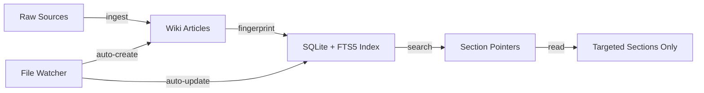
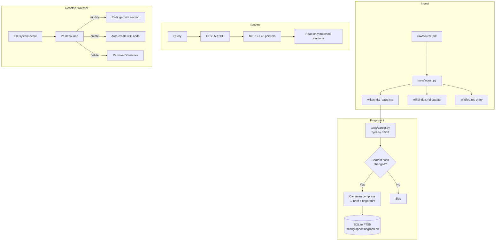

# MindGraph

Fingerprinted knowledge graph for Claude Code. Combines [Karpathy's LLM wiki pattern](https://gist.github.com/karpathy/442a6bf555914893e9891c11519de94f) with [Caveman compression](https://github.com/JuliusBrussee/caveman) to create a token-efficient, section-level indexed knowledge base with real-time reactive updates.

## How It Works



**The problem**: Claude Code sessions waste tokens reading entire files when they only need specific sections.

**The solution**: A three-layer knowledge system with section-level fingerprinting:

1. **Wiki layer** (Karpathy pattern): Raw sources are compiled into interlinked markdown articles
2. **Compression layer** (Caveman): Index entries are compressed ~65% for token efficiency
3. **Fingerprint layer** (SQLite + FTS5): Section-level search returns file:line pointers, not full documents
4. **Reactive layer** (watchdog): File changes auto-update fingerprints in real-time

## Installation

### Prerequisites

- Python 3.9+
- SQLite with FTS5 (included in Python stdlib)
- Claude CLI (for caveman compression — `claude --print`)
- `watchdog` (for real-time file watching)

### Step 1: Clone and install

```bash
git clone --recurse-submodules https://github.com/sandeep84397/mindgraph.git
cd mindgraph
pip install watchdog
```

### Step 2: Add MindGraph to your project

```bash
cd /path/to/your-project

# Initialize the knowledge base (creates wiki/, .mindgraph/, CLAUDE.md)
python3 -m tools init . --mode project

# Fingerprint existing wiki files
python3 -m tools fingerprint .

# Start the watcher (auto-indexes file changes)
python3 -m tools watch . start --watch src lib app tools
```

> **Note:** Replace `src lib app tools` with whatever directories contain your source code.

### Step 3: Verify it works

```bash
# Search the index
python3 -m tools search . "your search term"

# Check token savings
python3 -m tools stats .

# Health check
python3 -m tools lint .
```

### What `init --mode project` creates

```
your-project/
├── wiki/                   # Auto-generated wiki articles (commit these)
│   ├── schema.md           # Rules for wiki page structure
│   ├── index.md            # Table of contents
│   └── log.md              # Audit trail
├── .mindgraph/
│   └── mindgraph.db        # SQLite + FTS5 index (gitignored by default)
└── CLAUDE.md               # Tells Claude sessions to search the graph first
```

### Making Claude Code use it automatically

Add MindGraph's hooks to your project's `.claude/settings.json`:

```json
{
  "hooks": {
    "PostToolUse": [
      {
        "matcher": "Edit|Write",
        "command": "python3 -m tools fingerprint . --file \"$CLAUDE_FILE\" 2>/dev/null &",
        "timeout": 5000
      }
    ],
    "SessionStart": [
      {
        "command": "echo '[MindGraph] Knowledge base detected. Search before reading: python3 -m tools search . \"query\"'",
        "timeout": 3000
      }
    ]
  }
}
```

This gives you:
- **SessionStart**: Reminds Claude to search the graph before reading files
- **PostToolUse**: Auto-re-fingerprints any file Claude edits

> **Note:** `claude plugin install ./mindgraph` does not work. Claude Code's plugin marketplace only supports published plugins, not local directories. Use the hooks setup above instead.

## Quick Start

### As a standalone knowledge base

```bash
# Initialize
python3 -m tools init ~/my-research --mode standalone

# Start the reactive watcher
python3 -m tools watch ~/my-research start

# Ingest a source document
python3 -m tools ingest ~/my-research ~/papers/attention.pdf

# Search
python3 -m tools search ~/my-research "transformer attention mechanism"

# Check token savings
python3 -m tools stats ~/my-research
```

### As a project knowledge graph

```bash
# Initialize in your project root
python3 -m tools init . --mode project

# Start watcher — auto-creates wiki nodes for new/changed files
python3 -m tools watch . start --watch src lib app

# Search your project's knowledge graph
python3 -m tools search . "authentication middleware"

# Disable/enable search
python3 -m tools search . --disable
python3 -m tools search . --enable
```

## Architecture

```
your-project/
├── raw/                    # Immutable source documents
├── wiki/                   # LLM-compiled markdown articles
│   ├── schema.md           # Rules for wiki page structure
│   ├── index.md            # Categorical table of contents
│   ├── log.md              # Chronological audit trail
│   └── *.md                # Entity, topic, and summary pages
├── .mindgraph/
│   ├── mindgraph.db        # SQLite + FTS5 fingerprint index
│   └── watcher.pid         # Watcher daemon PID
└── CLAUDE.md               # (project mode) Instructions for Claude sessions
```

### Data Flow



## How Fingerprinting Works

Each wiki page is split into sections at h2/h3 heading boundaries. For each section:

1. **Content hash** (SHA-256) — detects if the section changed
2. **Brief** — caveman-compressed 1-line summary (e.g., "JWT auth middleware — validate, reject expired, pass context")
3. **Fingerprint** — caveman-compressed full section text

The SQLite FTS5 index enables full-text search across all briefs and fingerprints. A search query returns section pointers (`file:L12-L45`), so Claude reads only the relevant lines instead of entire files.

### Token Savings

| Without MindGraph | With MindGraph |
|-------------------|----------------|
| Read 400K words across 100 articles | Read ~5KB index + N matched sections |
| Every session starts cold | Sessions share the fingerprint DB |
| Manual re-reading on every query | Targeted reads via FTS5 pointers |

## Reactive Updates

The file watcher daemon (`tools/watch.py`) monitors your wiki and source directories:

- **File modified**: Content hash compared to DB → only changed sections re-fingerprinted
- **File created**: Auto-generates a wiki node with Summary/Details/References sections, then fingerprints it
- **File deleted**: Removes corresponding DB entries

```bash
# Start watcher
python3 -m tools watch . start

# Check status
python3 -m tools watch . status

# Stop
python3 -m tools watch . stop
```

The watcher uses a 2-second debounce window to batch rapid saves (e.g., IDE auto-save).

## Multi-Session Orchestration

Multiple Claude Code sessions can work against the same knowledge base:

```
Session A (ingest):    raw/paper.pdf → wiki/ → fingerprints updated
Session B (query):     reads index → pulls 3 sections → synthesizes answer
Session C (lint):      finds stale/orphan entries → fixes them
Session D (output):    generates slides from matched sections
```

The SQLite WAL mode ensures concurrent read/write safety.

## CLI Reference

| Command | Description |
|---------|-------------|
| `python3 -m tools init <path> [--mode standalone\|project]` | Initialize knowledge base |
| `python3 -m tools ingest <kb> <source> [--no-compile]` | Ingest a source document |
| `python3 -m tools fingerprint <kb> [--force] [--file path]` | Rebuild fingerprint index |
| `python3 -m tools search <kb> "query" [--limit N] [--no-learn]` | Search the index |
| `python3 -m tools search <kb> --disable \| --enable` | Toggle search on/off |
| `python3 -m tools lint <kb> [--fix]` | Health check |
| `python3 -m tools watch <kb> start\|stop\|status` | Manage file watcher |
| `python3 -m tools stats <kb> [--json]` | Show token savings stats |
| `python3 -m tools learn <kb> "topic" [--json]` | Learn a topic from codebase scan |

## Persisting the Knowledge Graph

By default, `.mindgraph/` is gitignored. The knowledge graph can be rebuilt from wiki files:

```bash
python3 -m tools fingerprint . --force
```

However, **tracking `.mindgraph/mindgraph.db` in git is recommended** for teams and long-lived projects. The DB accumulates value over time:

- **Caveman-compressed briefs** — each brief costs an LLM call to generate. Rebuilding a 500-section index means hundreds of API calls.
- **Cumulative stats** — search counts and token savings history are stored in the DB's metadata table.
- **Learn-on-miss pages** — auto-learned wiki entries from search misses build up project-specific knowledge that's expensive to regenerate.
- **Instant onboarding** — new clones get the full knowledge graph immediately with no rebuild step.

To enable, remove `.mindgraph/` from `.gitignore` and add:

```gitignore
# Track the DB but exclude SQLite temp files
.mindgraph/*.db-wal
.mindgraph/*.db-shm
.mindgraph/watcher.pid
```

For large projects where the DB exceeds ~5MB, consider [Git LFS](https://git-lfs.com/) or running `sqlite3 .mindgraph/mindgraph.db "VACUUM"` before commits to keep it compact.

## Credits

- [Andrej Karpathy](https://gist.github.com/karpathy/442a6bf555914893e9891c11519de94f) — LLM Wiki design pattern
- [Julius Brussee / Caveman](https://github.com/JuliusBrussee/caveman) — Token compression via caveman-speak

## License

MIT
