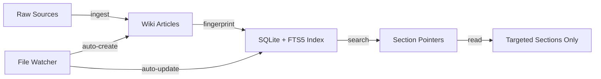
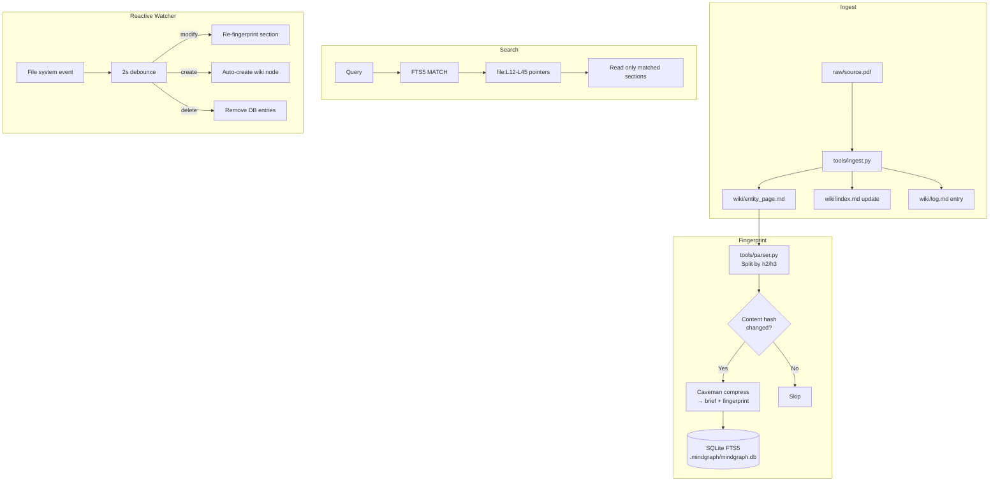

# MindGraph

Fingerprinted knowledge graph for Claude Code. Combines [Karpathy's LLM wiki pattern](https://gist.github.com/karpathy/442a6bf555914893e9891c11519de94f) with [Caveman compression](https://github.com/JuliusBrussee/caveman) to create a token-efficient, section-level indexed knowledge base with real-time reactive updates.

## How It Works



**The problem**: Claude Code sessions waste tokens reading entire files when they only need specific sections.

**The solution**: A three-layer knowledge system with section-level fingerprinting:

1. **Wiki layer** (Karpathy pattern): Raw sources are compiled into interlinked markdown articles
2. **Compression layer** (Caveman): Index entries are compressed ~65% for token efficiency
3. **Fingerprint layer** (SQLite + FTS5): Section-level search returns file:line pointers, not full documents
4. **Reactive layer** (watchdog): File changes auto-update fingerprints in real-time

## Installation

### As a Claude Code Plugin

```bash
# Clone and install
git clone --recurse-submodules https://github.com/sandeepdhami/mindgraph.git
cd mindgraph
pip install watchdog

# Install as Claude Code plugin
claude plugin install ./mindgraph
```

### Dependencies

- Python 3.9+
- SQLite with FTS5 (included in Python stdlib)
- `watchdog` (`pip install watchdog`)
- Claude CLI (`claude --print` for caveman compression)

## Quick Start

### Standalone Knowledge Base

```bash
# Initialize
python3 -m tools init ~/my-research --mode standalone

# Start the reactive watcher
python3 -m tools watch ~/my-research start

# Ingest a source
python3 -m tools ingest ~/my-research ~/papers/attention.pdf

# Search
python3 -m tools search ~/my-research "transformer attention mechanism"

# Health check
python3 -m tools lint ~/my-research
```

### Project Plugin

```bash
# Initialize in your project root
python3 -m tools init . --mode project

# Start watcher — auto-creates wiki nodes for new files
python3 -m tools watch . start

# Search your project's knowledge graph
python3 -m tools search . "authentication middleware"
```

## Architecture

```
your-project/
├── raw/                    # Immutable source documents
├── wiki/                   # LLM-compiled markdown articles
│   ├── schema.md           # Rules for wiki page structure
│   ├── index.md            # Categorical table of contents
│   ├── log.md              # Chronological audit trail
│   └── *.md                # Entity, topic, and summary pages
├── .mindgraph/
│   ├── mindgraph.db        # SQLite + FTS5 fingerprint index
│   └── watcher.pid         # Watcher daemon PID
└── CLAUDE.md               # (project mode) Instructions for Claude sessions
```

### Data Flow



## How Fingerprinting Works

Each wiki page is split into sections at h2/h3 heading boundaries. For each section:

1. **Content hash** (SHA-256) — detects if the section changed
2. **Brief** — caveman-compressed 1-line summary (e.g., "JWT auth middleware — validate, reject expired, pass context")
3. **Fingerprint** — caveman-compressed full section text

The SQLite FTS5 index enables full-text search across all briefs and fingerprints. A search query returns section pointers (`file:L12-L45`), so Claude reads only the relevant lines instead of entire files.

### Token Savings

| Without MindGraph | With MindGraph |
|-------------------|----------------|
| Read 400K words across 100 articles | Read ~5KB index + N matched sections |
| Every session starts cold | Sessions share the fingerprint DB |
| Manual re-reading on every query | Targeted reads via FTS5 pointers |

## Reactive Updates

The file watcher daemon (`tools/watch.py`) monitors your wiki and source directories:

- **File modified**: Content hash compared to DB → only changed sections re-fingerprinted
- **File created**: Auto-generates a wiki node with Summary/Details/References sections, then fingerprints it
- **File deleted**: Removes corresponding DB entries

```bash
# Start watcher
python3 -m tools watch . start

# Check status
python3 -m tools watch . status

# Stop
python3 -m tools watch . stop
```

The watcher uses a 2-second debounce window to batch rapid saves (e.g., IDE auto-save).

## Multi-Session Orchestration

Multiple Claude Code sessions can work against the same knowledge base:

```
Session A (ingest):    raw/paper.pdf → wiki/ → fingerprints updated
Session B (query):     reads index → pulls 3 sections → synthesizes answer
Session C (lint):      finds stale/orphan entries → fixes them
Session D (output):    generates slides from matched sections
```

The SQLite WAL mode ensures concurrent read/write safety.

## CLI Reference

| Command | Description |
|---------|-------------|
| `python3 -m tools init <path> [--mode standalone\|project]` | Initialize knowledge base |
| `python3 -m tools ingest <kb> <source>` | Ingest a source document |
| `python3 -m tools fingerprint <kb> [--force] [--file path]` | Rebuild fingerprint index |
| `python3 -m tools search <kb> "query" [--limit N] [--verbose]` | Search the index |
| `python3 -m tools lint <kb> [--fix]` | Health check |
| `python3 -m tools watch <kb> start\|stop\|status` | Manage file watcher |

## Credits

- [Andrej Karpathy](https://gist.github.com/karpathy/442a6bf555914893e9891c11519de94f) — LLM Wiki design pattern
- [Julius Brussee / Caveman](https://github.com/JuliusBrussee/caveman) — Token compression via caveman-speak

## License

MIT
