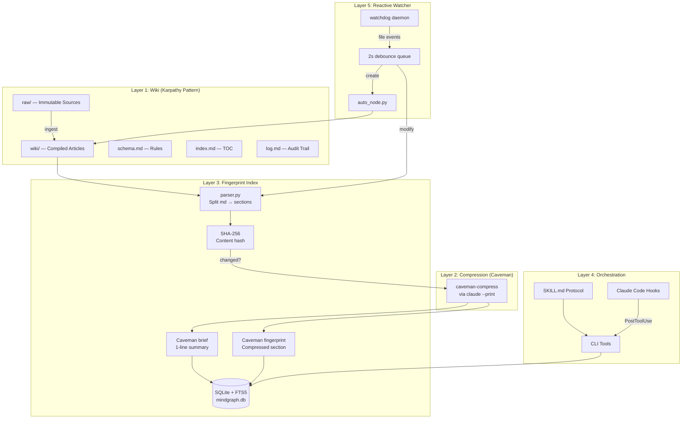
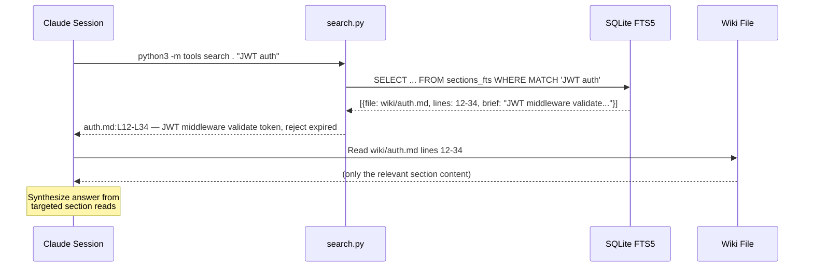
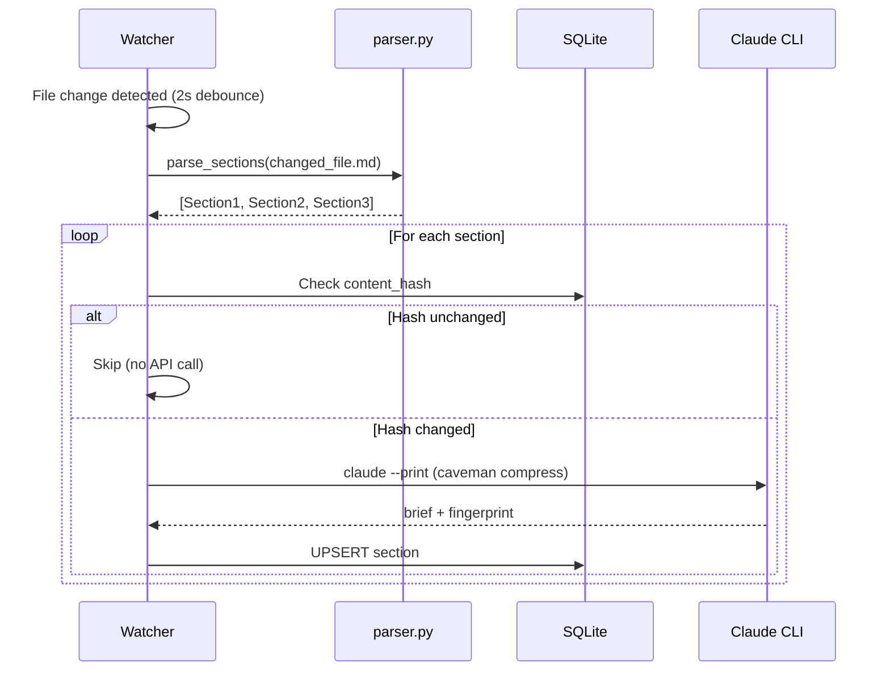
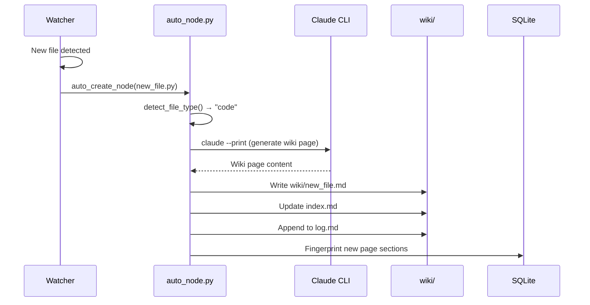
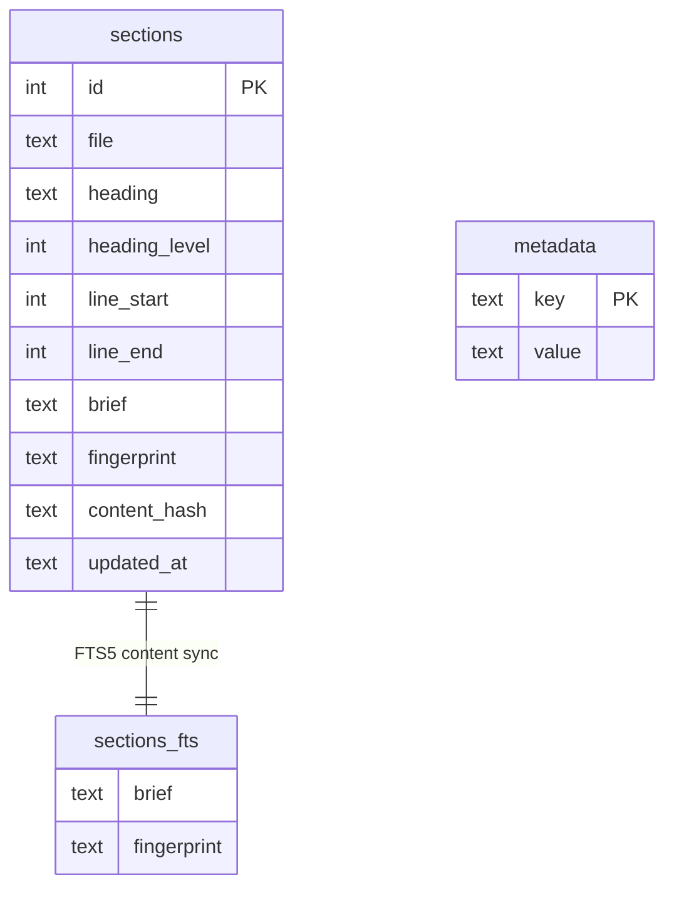
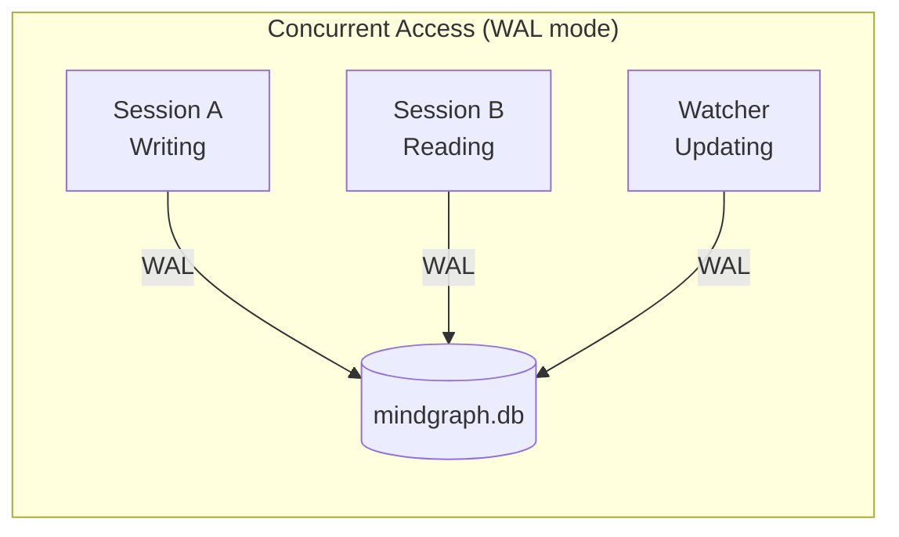

# MindGraph Architecture

## System Overview

## Search Flow

## Fingerprint Update Flow

## Auto-Create Node Flow

## SQLite Schema

## Concurrency Model

SQLite WAL (Write-Ahead Logging) mode allows:
- Multiple concurrent readers
- Single writer (with readers not blocked)
- Watcher daemon and Claude sessions coexist safely
